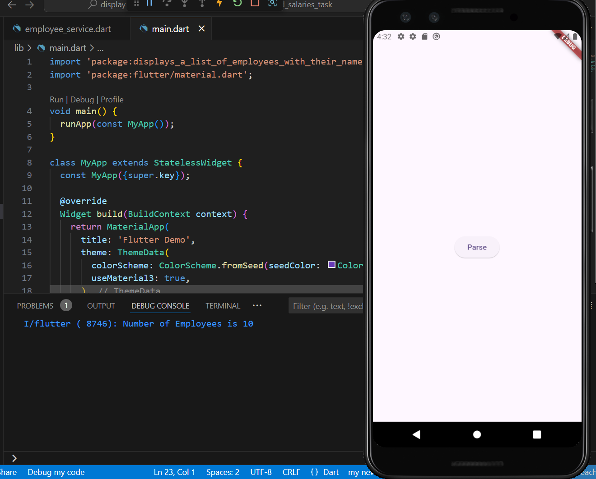

# displays_a_list_of_employees_with_their_names_and_salaries_task

# Employee List App

Fetch employee data using HTTP then Parse JSON responses and map them to model.
## Features

- Fetches employee data from an API using HTTP for API call.
- Map responses to a model.
- Error handling for API requests.

## Screenshots

